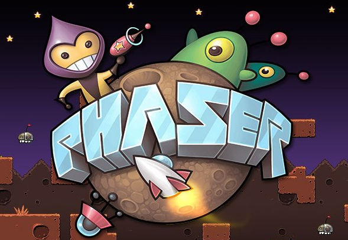

<h1 align="center">
  Phaser Game Template
</h1>

## Preview

 You can check demo [Play game!]()

## Key Features

- Phaser 3
- Webpack
- TypeScript
- Eslint / Prettier

<a href="https://s3.eu-central-1.amazonaws.com/phaser3-typescript/starter-template/index.html">

</a>

## How To Use

```bash
# Clone this repository (yes, npx not npm)
$ git clone https://github.com/justMikhail/phaser-game-template.git

# Install dependencies
$ npm install

# Start the local development server (on port 8080)
$ npm start

# Build the production ready code to the /dist folder
$ npm run build

# Play your production ready game in the browser
$ npm run serve
```

### Typings

You can put your custom type definitions inside typings/**custom.d.ts**.

### Webpack

All webpack configs are in the **webpack** folder.

## Useful Links

- [Phaser Website](https://phaser.io/)
- [Phaser 3 Forum](https://phaser.discourse.group/)
- [Phaser 3 API Docs](https://photonstorm.github.io/phaser3-docs/)
